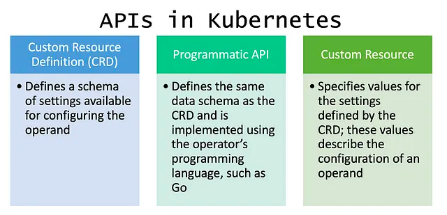
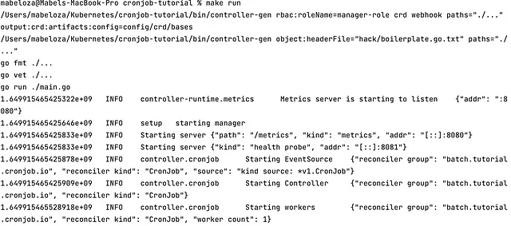

## Cronjob Kubernetes Operator

Kubebuilder is our friend that will help us scaffold our Kubernetes API project. We’ll cover a few brief concepts and then we’re going to walk through creating Kubernetes APIs using Kubebuilder.

> CAUTION: Do every step in order, I learned the hard way, Kubebuilder can be finicky if you jump around.

## Key Concepts

### APIs (Application Programming Interface) in Kubernetes

APIs allow you to interact with a specific service or UI. In a Kubernetes context, APIs allow us to add features to our Kubernetes cluster.



[api-concepts](https://kubernetes.io/docs/reference/using-api/api-concepts/)

### Controller

Each controller implements a control loop that watches the cluster's shared state via the API server and makes changes as needed, consistently bringing it back to the desired state.

Think of controllers like a central air thermostat, if it’s a hot day you set the temperature to 65 degrees and throughout the day the thermos consistently brings the room back to 65 degrees.

### Reconciler

In every controller, the reconciler is the logic that’s triggered by cluster events. The reconcile function takes the name of an object and returns whether or not the state matches the desired state.


### Control Plane

Kubernetes has a control plane that’s an orchestration layer that exposes APIs and interfaces to define, deploy, and manage the lifecycle of containers. Kubernetes controllers run in the control plane and operators’ controllers run in the worker nodes.

One of the components in the control plane is an API server that exposes these APIs. The other component in the control plane is a controller manager that runs the controller processes, each controller has a specific responsibility as part of managing the cluster.

## Setting Up Environment

You need:

- Go
- Docker
- Minikube
- Kubectl
- Kustomize
- Kubebuilder
- IDE for Go Programming

**Go**

Download the appropriate Go installer from https://go.dev/dl/. You must have 1.17, at the time this article was published 1.18 is not supported.

**Docker**

Download the appropriate Docker installer from https://docs.docker.com/get-docker/

**Minikube**

Download the appropriate Minikube installer from https://minikube.sigs.k8s.io/docs/start/

**Kubectl**

Find the appropriate installation instructions on the page https://kubernetes.io/docs/tasks/tools/. You will need to handle the kubectl folder permissions.

**Kustomize**

Find the appropriate installation instructions on the page https://kubectl.docs.kubernetes.io/installation/kustomize/

**Kubebuilder**

Run the command below to install Kubebuilder, you can find the instructions on the page https://book.kubebuilder.io/quick-start.html.

```shell
# download kubebuilder and install locally.
curl -L -o kubebuilder https://go.kubebuilder.io/dl/latest/$(go env GOOS)/$(go env GOARCH)
chmod +x kubebuilder && mv kubebuilder /usr/local/bin/
```

## 1. Initializing Project

Create a project folder for this example we’ll create CronJob Kubernetes APIs with our CronJob project.

```shell
mkdir cronjob && cd cronjob
```

Now initialize the folder with kubebuilder using the comman

```shell
kubebuilder init --domain cronjob.kubebuilder.io --repo cronjob.kubebuilder.io/project
```

After running the initializer you will see that a Dockerfile, Makefile, main go program, and config folder are generated.


The config folder has a ton of YAML files as you can see below. Default has the Kustomize base for launching the controller. Manager launches the controllers as pods in the cluster. Prometheus handles the metrics for the project. RBAC handles the permissions required to run the controller under their own service account.


## 2. Create APIs

Now we’re going to create our APIs by running:

```shell
kubebuilder create api --group batch --version v1 --kind CronJob
```

Select Y for “Create Resource” and “Create Controller”.

Running the command above will generate an API, controller, and crd (under config) folder. You will find our Kind CronJob (cronjob_types.go). Each API group version contains one or more API types, which we call Kinds.

### Running your Scaffolded Project

**Build Project**

If you open up the Make file (Makefile) you will see all the commands you run for the project. The very first step is to `make all` this will build out the project.

**Generate the Controller-Gen and Manager Scripts**

Run `make manifests` to generate CRD (Custom Resource Definitions), webhook configuration, and cluster roles, and now you should see the bin folder with controller-gen and manager.


Then run `make generate`, this will generate the code containing deepCopy, deepCopyInto, and deepCopyObject.

NOTE: If you don’t run` make all` you won’t get the manager script in the bin folder.

**Build and Run**

Let’s make sure everything can get up and running on your host. You will need to stand up your local Kubernetes cluster, you can either use Minikube or Kind, in this exercise we’re using Minikube.

In a separate terminal run the command `minikube start`.


To check that your cluster is up and running properly you can run `kubectl get po -A`.

Now your local cluster is up and running, let’s build and run our project. Running `make build` runs the manager in the bin folder with the main.go file. Running `make run` will run the project.



Now you can find the Prometheus metrics at http://localhost:8080/metrics.


You will find the readyz status at http://localhost:8081/healthz and the ready status at http://localhost:8081/readyz. I know these URLs because they are stated in the main.go file in the lines below:

```go
if err := mgr.AddHealthzCheck("healthz", healthz.Ping); err != nil {
   setupLog.Error(err, "unable to set up health check")
   os.Exit(1)
}
if err := mgr.AddReadyzCheck("readyz", healthz.Ping); err != nil {
   setupLog.Error(err, "unable to set up ready check")
   os.Exit(1)
}
```

### CronJob Kind (cronjob_types.go)

Let’s create our cron job by adding a piece that schedules the cron job and templates the job. Open up the `~/api/v1/cronjob_types.go` file and start coding the following:

**Dependencies**

Below are the dependencies required for the cronjob_types:

```go
import (
   batchv1beta1 "k8s.io/api/batch/v1beta1"
   corev1 "k8s.io/api/core/v1"
   metav1 "k8s.io/apimachinery/pkg/apis/meta/v1"
)
```

**Cron Job Spec**

We’ll define the desired state of the CronJob in the type CronJobSpec struct, you can remove the comments but leave the `// + comment` because it’s metadata that will be used by controller-tools when we generate our CRD manifest.

```go
type CronJobSpec struct {
   //+kubebuilder:validation:MinLength=0
   Schedule string `json:"schedule"`

   //+kubebuilder:validation:MinLength=0
   // +optional
   StartingDeadlineSeconds *int64 `json:"startingDeadlineSeconds,omitempty"`
   // +optional
   ConcurrencyPolicy ConcurrencyPolicy `json:"concurrencyPolicy,omitempty"`
   // +optional
   Suspend *bool `json:"suspend,omitempty"`

   JobTemplate batchv1beta1.JobTemplateSpec `json:"jobTemplate"`
   //+kubebuilder:validation:Minimum=0
   // +optional
   SuccessfulJobHistoryLimit *int32 `json:"successfulJobHistoryLimit,omitempty"`

   //+kubebuilder:validation:Minimum=0

   // +optional
   FailedJobsHistoryLimit *int32 `json:"failedJobsHistoryLimit"`
}
```

**Concurrency Policy**

Here we deal with the Concurrency Policy by adding the lines:

```go
// +kubebuilder:validation:Enum=Allow;Forbid;Replace
type ConcurrencyPolicy string

const (
   // AllowConcurrent allows CronJobs to run concurrently.
   AllowConcurrent ConcurrencyPolicy = "Allow"

   // ForbidCurrent ForbidConcurrent forbids concurrent runs, skipping next run if previous
   // hasn't finished yet.
   ForbidCurrent ConcurrencyPolicy = "Forbid"

   // ReplaceConcurrent ReplacementConcurrent cancels currently running job and replaces it with a new one.
   ReplaceConcurrent ConcurrencyPolicy = "Replace"
)
```

**Cron Job Status**

Now we need to design the status that holds observed states.

```go
type CronJobStatus struct {
   
   // +optional
   Active []corev1.ObjectReference `json:"active,omitempty"`

   // +optional
   LastScheduleTime *metav1.Time `json:"LastScheduleTime,omitempty"`
}
```

**Cron Job Schema**

```go
type CronJob struct {
  metav1.TypeMeta   `json:",inline"`     
  metav1.ObjectMeta `json:"metadata,omitempty"`      
  Spec   CronJobSpec   `json:"spec,omitempty"`     
  Status CronJobStatus `json:"status,omitempty"`
}
```

**Cron Job List**

```go
// CronJobList contains a list of CronJob 
type CronJobList struct {     
  metav1.TypeMeta `json:",inline"`     
  metav1.ListMeta `json:"metadata,omitempty"`     
  Items           []CronJob `json:"items"` 
}
```

Then we initialize CronJob and CronJobList by registering them to our SchemaBuilder

```go
func init() {
    SchemeBuilder.Register(&CronJob{}, &CronJobList{})
}
```

The end product of the cronjob_types.go file should like the following:

```go
/*
Copyright 2022.

Licensed under the Apache License, Version 2.0 (the "License");
you may not use this file except in compliance with the License.
You may obtain a copy of the License at

    http://www.apache.org/licenses/LICENSE-2.0

Unless required by applicable law or agreed to in writing, software
distributed under the License is distributed on an "AS IS" BASIS,
WITHOUT WARRANTIES OR CONDITIONS OF ANY KIND, either express or implied.
See the License for the specific language governing permissions and
limitations under the License.
*/

package v1

import (
	batchv1beta1 "k8s.io/api/batch/v1beta1"
	corev1 "k8s.io/api/core/v1"
	metav1 "k8s.io/apimachinery/pkg/apis/meta/v1"
)

// EDIT THIS FILE!  THIS IS SCAFFOLDING FOR YOU TO OWN!
// NOTE: json tags are required.  Any new fields you add must have json tags for the fields to be serialized.

// CronJobSpec defines the desired state of CronJob
type CronJobSpec struct {
	//+kubebuilder:validation:MinLength=0

	// The schedule in Cron format, see https://en.wikipedia.org/wiki/Cron.
	Schedule string `json:"schedule"`

	//+kubebuilder:validation:Minimum=0

	// Optional deadline in seconds for starting the job if it misses scheduled
	// time for any reason.  Missed jobs executions will be counted as failed ones.
	// +optional
	StartingDeadlineSeconds *int64 `json:"startingDeadlineSeconds,omitempty"`

	// Specifies how to treat concurrent executions of a Job.
	// Valid values are:
	// - "Allow" (default): allows CronJobs to run concurrently;
	// - "Forbid": forbids concurrent runs, skipping next run if previous run hasn't finished yet;
	// - "Replace": cancels currently running job and replaces it with a new one
	// +optional
	ConcurrencyPolicy ConcurrencyPolicy `json:"concurrencyPolicy,omitempty"`

	// This flag tells the controller to suspend subsequent executions, it does
	// not apply to already started executions.  Defaults to false.
	// +optional
	Suspend *bool `json:"suspend,omitempty"`

	// Specifies the job that will be created when executing a CronJob.
	JobTemplate batchv1beta1.JobTemplateSpec `json:"jobTemplate"`

	//+kubebuilder:validation:Minimum=0

	// The number of successful finished jobs to retain.
	// This is a pointer to distinguish between explicit zero and not specified.
	// +optional
	SuccessfulJobsHistoryLimit *int32 `json:"successfulJobsHistoryLimit,omitempty"`

	//+kubebuilder:validation:Minimum=0

	// The number of failed finished jobs to retain.
	// This is a pointer to distinguish between explicit zero and not specified.
	// +optional
	FailedJobsHistoryLimit *int32 `json:"failedJobsHistoryLimit,omitempty"`
}

// ConcurrencyPolicy describes how the job will be handled.
// Only one of the following concurrent policies may be specified.
// If none of the following policies is specified, the default one
// is AllowConcurrent.
// +kubebuilder:validation:Enum=Allow;Forbid;Replace
type ConcurrencyPolicy string

const (
	// AllowConcurrent allows CronJobs to run concurrently.
	AllowConcurrent ConcurrencyPolicy = "Allow"

	// ForbidCurrent ForbidConcurrent forbids concurrent runs, skipping next run if previous
	// hasn't finished yet.
	ForbidCurrent ConcurrencyPolicy = "Forbid"

	// ReplaceConcurrent ReplacementConcurrent cancels currently running job and replaces it with a new one.
	ReplaceConcurrent ConcurrencyPolicy = "Replace"
)

// CronJobStatus defines the observed state of CronJob
type CronJobStatus struct {
	// INSERT ADDITIONAL STATUS FIELD - define observed state of cluster
	// Important: Run "make" to regenerate code after modifying this file

	// A list of pointers to currently running jobs.
	// +optional
	Active []corev1.ObjectReference `json:"active,omitempty"`

	// Information when was the last time the job was successfully scheduled.
	// +optional
	LastScheduleTime *metav1.Time `json:"LastScheduleTime,omitempty"`
}

// +kubebuilder:docs-gen:collapse=old stuff

//+kubebuilder:object:root=true
//+kubebuilder:subresource:status

// CronJob is the Schema for the cronjobs API
type CronJob struct {
	metav1.TypeMeta   `json:",inline"`
	metav1.ObjectMeta `json:"metadata,omitempty"`

	Spec   CronJobSpec   `json:"spec,omitempty"`
	Status CronJobStatus `json:"status,omitempty"`
}

//+kubebuilder:object:root=true

// CronJobList contains a list of CronJob
type CronJobList struct {
	metav1.TypeMeta `json:",inline"`
	metav1.ListMeta `json:"metadata,omitempty"`
	Items           []CronJob `json:"items"`
}

func init() {
	SchemeBuilder.Register(&CronJob{}, &CronJobList{})
}
```

### Controller (cronjob_controller.go)

Here the controller’s job is to:

1. Load the named CronJob
2. List all active jobs, and update the status
3. Clean up old jobs
4. Check if the job is suspended
5. Get the next scheduled run
6. Run a new job if it’s on schedule (if it’s not a past the deadline and blocked by the concurrency policy)
7. Requeue when we either see a running job or it’s time for the next scheduled run

**Dependencies**

This controller will use the following dependencies, the last batchv1 is a reference to the API we built earlier (the name might vary depending on the package name chosen):

```go
import ( 
   "context" 
   "fmt" 
   "sort" 
   "time"  
   "github.com/robfig/cron"    
   kbatch "k8s.io/api/batch/v1" 
   corev1 "k8s.io/api/core/v1" 
   metav1 "k8s.io/apimachinery/pkg/apis/meta/v1"      
   "k8s.io/apimachinery/pkg/runtime" 
   ref "k8s.io/client-go/tools/reference" 
   ctrl "sigs.k8s.io/controller-runtime"  
   "sigs.k8s.io/controller-runtime/pkg/client"  
   "sigs.k8s.io/controller-runtime/pkg/log"  
   batchv1 "tutorial.cronjob.io/project/api/v1"
)
```

**Clock**

The most essential piece in Cron Job program is a clock, below we create our clock.

```go
/*
We'll mock out the clock to make it easier to jump around in time while testing,
the "real" clock just calls `time.Now`.
*/
type realClock struct{}

func (_ realClock) Now() time.Time { return time.Now() }

// clock knows how to get the current time.
// It can be used to fake out timing for testing.
type Clock interface {
   Now() time.Time
}
// +kubebuilder:docs-gen:collapse=Clock
```

Now we add the clock into our Cron Job Reconciler:

```go
// CronJobReconciler reconciles a CronJob object
type CronJobReconciler struct {
   client.Client
   Scheme *runtime.Scheme
   Clock

```

**RBAC Permissions**

We add in RBAC permissions since we’re now creating and managing jobs.

```go
//+kubebuilder:rbac:groups=batch.tutorial.cronjob.io,resources=cronjobs,verbs=get;list;watch;create;update;patch;delete
//+kubebuilder:rbac:groups=batch.tutorial.cronjob.io,resources=cronjobs/status,verbs=get;update;patch
//+kubebuilder:rbac:groups=batch.tutorial.cronjob.io,resources=cronjobs/finalizers,verbs=update
//+kubebuilder:rbac:groups=batch,resources=jobs,verbs=get;list;watch;create;update;patch;delete
//+kubebuilder:rbac:groups=batch,resources=jobs/status,verbs=get
```

> Note: Make sure the group name matches your group name, you can find the group name in your groupversion_info.go file.
> ```go
> GroupVersion = schema.GroupVersion{Group: "batch.tutorial.cronjob.io", Version: "v1"}
> ```

**Reconciler Logic**

The first step in the reconcile logic is to create a variable to annotate the scheduled time.

```go
var (
   scheduledTimeAnnotation = "batch.tutorial.kubebuilder.io/scheduled-at"
)
```
Now let’s jump into our reconcile function, this is where all the action happens. Our reconciler function looks like this, if you named your project something else then you won’t see CronJobReconciler, it will be something else.

```go
func (r *CronJobReconciler) Reconcile(ctx context.Context, req ctrl.Request) (ctrl.Result, error) {
```

To keep track of what’s going to happen initialize a logger below the reconcile function

```go
log := log.FromContext(ctx)
```

**Implementation**

1. Load the CronJob by name
2. List all active jobs and update the status
3. Clean up old jobs according to the history limit
4. Check if we’re suspended
5. Get the next scheduled run
6. Run a new job if it’s on schedule, not past the deadline, and blocked by concurrency policy
7. Requeue when we either see a running job or it’s time for the next scheduled run

#### 1. Load the CronJob by name

We will grab the CronJob struct we created in API (cronjob_types.go) and put it into a variable called cronJob. If we fail to fetch it, we have a proper way to handle it.

```go
var cronJob batchv1.CronJob
if err := r.Get(ctx, req.NamespacedName, &cronJob); err != nil {
   log.Error(err, "unable to fetch CronJob")

   return ctrl.Result{}, client.IgnoreNotFound(err)
}
```

#### 2. List all active jobs and update the status

```go
var childJobs kbatch.JobList
if err := r.List(ctx, &childJobs, client.InNamespace(req.Namespace), client.MatchingFields{jobOwnerKey: req.Name}); err != nil {
   log.Error(err, "unable to list child Jobs")
   return ctrl.Result{}, err
}
```

Find the active list of jobs

```go
var activeJobs []*kbatch.Job
var successfulJobs []*kbatch.Job
var failedJobs []*kbatch.Job
var mostRecentTime *time.Time // find the last run so we can update the status
```

Mark a job “finished” if it has a “complete” or “failed” condition marked true.

```go
isJobFinished := func(job *kbatch.Job) (bool, kbatch.JobConditionType) {
   for _, c := range job.Status.Conditions {
      if (c.Type == kbatch.JobComplete || c.Type == kbatch.JobFailed) && c.Status == corev1.ConditionTrue {
         return true, c.Type
      }
   }

   return false, ""
}
// +kubebuilder:docs-gen:collapse=isJobFinished
```

Extract the scheduled time from the annotation added earlier (remember scheduledTimeAnnotation before the reconcile function)

```go
getScheduledTimeForJob := func(job *kbatch.Job) (*time.Time, error) {
   timeRaw := job.Annotations[scheduledTimeAnnotation]
   if len(timeRaw) == 0 {
      return nil, nil
   }

   timeParsed, err := time.Parse(time.RFC3339, timeRaw)
   if err != nil {
      return nil, err
   }
   return &timeParsed, nil
}
// +kubebuilder:docs-gen:collapse=getScheduledTimeForJob
```

Run through the Job Lists, active, failed, and complete, and populate our active, failed, and successful markers accordingly. Take the scheduled time and use that to figure out the most recent time. Then take the most recent time to figure out the last scheduled time

```go
for i, job := range childJobs.Items {
   _, finishedType := isJobFinished(&job)
   switch finishedType {
   case "": // ongoing
      activeJobs = append(activeJobs, &childJobs.Items[i])
   case kbatch.JobFailed:
      failedJobs = append(failedJobs, &childJobs.Items[i])
   case kbatch.JobComplete:
      successfulJobs = append(successfulJobs, &childJobs.Items[i])
   }

   // We'll store the launch time in an annotation, so we'll reconstitute that from
   // the active jobs themselves.
   scheduledTimeForJob, err := getScheduledTimeForJob(&job)
   if err != nil {
      log.Error(err, "unable to parse schedule time for child job", "job", &job)
      continue
   }
   if scheduledTimeForJob != nil {
      if mostRecentTime == nil {
         mostRecentTime = scheduledTimeForJob
      } else if mostRecentTime.Before(*scheduledTimeForJob) {
         mostRecentTime = scheduledTimeForJob
      }
   }
}
if mostRecentTime != nil {
   cronJob.Status.LastScheduleTime = &metav1.Time{Time: *mostRecentTime}
} else {
   cronJob.Status.LastScheduleTime = nil
}
cronJob.Status.Active = nil
for _, activeJob := range activeJobs {
   jobRef, err := ref.GetReference(r.Scheme, activeJob)
   if err != nil {
      log.Error(err, "unable to make reference to active job", "job", activeJob)
      continue
   }
   cronJob.Status.Active = append(cronJob.Status.Active, *jobRef)
}
```

Log how many jobs we observe.

```go
log.V(1).Info("job count", "active jobs", len(activeJobs), "successful jobs", len(successfulJobs), "failed jobs", len(failedJobs))
```

Update the status

```go
if err := r.Status().Update(ctx, &cronJob); err != nil {
log.Error(err, "unable to update CronJob status")
return ctrl.Result{}, err
}
```

#### 3. Clean up old jobs according to the history limit

```go
// NB: deleting these is "best effort" -- if we fail on a particular one,
// we won't requeue just to finish the deleting.
if cronJob.Spec.FailedJobsHistoryLimit != nil {
   sort.Slice(failedJobs, func(i, j int) bool {
      if failedJobs[i].Status.StartTime == nil {
         return failedJobs[j].Status.StartTime != nil
      }
      return failedJobs[i].Status.StartTime.Before(failedJobs[j].Status.StartTime)
   })
   for i, job := range failedJobs {
      if int32(i) >= int32(len(failedJobs))-*cronJob.Spec.FailedJobsHistoryLimit {
         break
      }
      if err := r.Delete(ctx, job, client.PropagationPolicy(metav1.DeletePropagationBackground)); client.IgnoreNotFound(err) != nil {
         log.Error(err, "unable to delete old failed job", "job", job)
      } else {
         log.V(0).Info("deleted old failed job", "job", job)
      }
   }
}
```

#### 4. Check if we’re suspended

```go
if cronJob.Spec.Suspend != nil && *cronJob.Spec.Suspend {
   log.V(1).Info("cronjob suspended, skipping")
   return ctrl.Result{}, nil
}
```

#### 5. Get the next scheduled run

```go
getNextSchedule := func(cronJob *batchv1.CronJob, now time.Time) (lastMissed time.Time, next time.Time, err error) {
   sched, err := cron.ParseStandard(cronJob.Spec.Schedule)
   if err != nil {
      return time.Time{}, time.Time{}, fmt.Errorf("Unparseable schedule %q: %v", cronJob.Spec.Schedule, err)
   }

   var earliestTime time.Time
   if cronJob.Status.LastScheduleTime != nil {
      earliestTime = cronJob.Status.LastScheduleTime.Time
   } else {
      earliestTime = cronJob.ObjectMeta.CreationTimestamp.Time
   }
   if cronJob.Spec.StartingDeadlineSeconds != nil {
      // controller is not going to schedule anything below this point
      schedulingDeadline := now.Add(-time.Second * time.Duration(*cronJob.Spec.StartingDeadlineSeconds))

      if schedulingDeadline.After(earliestTime) {
         earliestTime = schedulingDeadline
      }
   }
   if earliestTime.After(now) {
      return time.Time{}, sched.Next(now), nil
   }

   starts := 0
   for t := sched.Next(earliestTime); !t.After(now); t = sched.Next(t) {
      lastMissed = t
      starts++
      if starts > 100 {
         return time.Time{}, time.Time{}, fmt.Errorf("Too many missed start times (> 100). Set or decrease .spec.startingDeadlineSeconds or check clock skew.")
      }
   }
   return lastMissed, sched.Next(now), nil
}
// +kubebuilder:docs-gen:collapse=getNextSchedule
```

#### 6. Run a new job if it’s on schedule, not past the deadline, and blocked by concurrency policy

```go
missedRun, nextRun, err := getNextSchedule(&cronJob, r.Now())
if err != nil {
   log.Error(err, "unable to figure out CronJob schedule")
   return ctrl.Result{}, nil
}

scheduledResult := ctrl.Result{RequeueAfter: nextRun.Sub(r.Now())} 
log = log.WithValues("now", r.Now(), "next run", nextRun)

/*
   ### 6: Run a new job if it's on schedule, not past the deadline, and not blocked by our concurrency policy
   If we've missed a run, and we're still within the deadline to start it, we'll need to run a job.
*/
if missedRun.IsZero() {
   log.V(1).Info("no upcoming scheduled times, sleeping until next")
   return scheduledResult, nil
}

// make sure we're not too late to start the run
log = log.WithValues("current run", missedRun)
tooLate := false
if cronJob.Spec.StartingDeadlineSeconds != nil {
   tooLate = missedRun.Add(time.Duration(*cronJob.Spec.StartingDeadlineSeconds) * time.Second).Before(r.Now())
}
if tooLate {
   log.V(1).Info("missed starting deadline for last run, sleeping till next")
   return scheduledResult, nil
}
if cronJob.Spec.ConcurrencyPolicy == batchv1.ForbidConcurrent && len(activeJobs) > 0 {
   log.V(1).Info("concurrency policy blocks concurrent runs, skipping", "num active", len(activeJobs))
   return scheduledResult, nil
}

if cronJob.Spec.ConcurrencyPolicy == batchv1.ReplaceConcurrent {
   for _, activeJob := range activeJobs {
      // we don't care if the job was already deleted
      if err := r.Delete(ctx, activeJob, client.PropagationPolicy(metav1.DeletePropagationBackground)); client.IgnoreNotFound(err) != nil {
         log.Error(err, "unable to delete active job", "job", activeJob)
         return ctrl.Result{}, err
      }
   }
}
```

Construct a job based on the CronJob’s template

```go
constructJobForCronJob := func(cronJob *batchv1.CronJob, scheduledTime time.Time) (*kbatch.Job, error) {
   name := fmt.Sprintf("%s-%d", cronJob.Name, scheduledTime.Unix())

   job := &kbatch.Job{
      ObjectMeta: metav1.ObjectMeta{
         Labels:      make(map[string]string),
         Annotations: make(map[string]string),
         Name:        name,
         Namespace:   cronJob.Namespace,
      },
      Spec: *cronJob.Spec.JobTemplate.Spec.DeepCopy(),
   }
   for k, v := range cronJob.Spec.JobTemplate.Annotations {
      job.Annotations[k] = v
   }
   job.Annotations[scheduledTimeAnnotation] = scheduledTime.Format(time.RFC3339)
   for k, v := range cronJob.Spec.JobTemplate.Labels {
      job.Labels[k] = v
   }
   if err := ctrl.SetControllerReference(cronJob, job, r.Scheme); err != nil {
      return nil, err
   }

   return job, nil
}
// +kubebuilder:docs-gen:collapse=constructJobForCronJob
// actually make the job...
job, err := constructJobForCronJob(&cronJob, missedRun)
if err != nil {
   log.Error(err, "unable to construct job from template")
   // don't bother requeuing until we get a change to the spec
   return scheduledResult, nil
}

// ...and create it on the cluster
if err := r.Create(ctx, job); err != nil {
   log.Error(err, "unable to create Job for CronJob", "job", job)
   return ctrl.Result{}, err
}

log.V(1).Info("created Job for CronJob run", "job", job)
```

#### 7. Requeue when we either see a running job or it’s time for the next scheduled run

```go
return scheduledResult, nil
```

**Setup**

```go
var (
   jobOwnerKey = ".metadata.controller"
   apiGVStr    = batchv1.GroupVersion.String()
)

func (r *CronJobReconciler) SetupWithManager(mgr ctrl.Manager) error {
   // set up a real clock, since we're not in a test
   if r.Clock == nil {
      r.Clock = realClock{}
   }

   if err := mgr.GetFieldIndexer().IndexField(context.Background(), &kbatch.Job{}, jobOwnerKey, func(rawObj client.Object) []string {
      // grab the job object, extract the owner...
      job := rawObj.(*kbatch.Job)
      owner := metav1.GetControllerOf(job)
      if owner == nil {
         return nil
      }
      // ...make sure it's a CronJob...
      if owner.APIVersion != apiGVStr || owner.Kind != "CronJob" {
         return nil
      }

      // ...and if so, return it
      return []string{owner.Name}
   }); err != nil {
      return err
   }

   return ctrl.NewControllerManagedBy(mgr).
      For(&batchv1.CronJob{}).
      Owns(&kbatch.Job{}).
      Complete(r)
}
```

Now there you have it, you’re done with your API and controller. At the end of it all your `~/controllers/cronjob_controller.go` should look like the code below:

```go
/*
Copyright 2022.

Licensed under the Apache License, Version 2.0 (the "License");
you may not use this file except in compliance with the License.
You may obtain a copy of the License at

    http://www.apache.org/licenses/LICENSE-2.0

Unless required by applicable law or agreed to in writing, software
distributed under the License is distributed on an "AS IS" BASIS,
WITHOUT WARRANTIES OR CONDITIONS OF ANY KIND, either express or implied.
See the License for the specific language governing permissions and
limitations under the License.
*/

package controllers

import (
	"context" 
	"fmt" 
	"sort" 
	"time"  
	"github.com/robfig/cron"    
	kbatch "k8s.io/api/batch/v1" 
	corev1 "k8s.io/api/core/v1" 
	metav1 "k8s.io/apimachinery/pkg/apis/meta/v1"      
	"k8s.io/apimachinery/pkg/runtime" 
	ref "k8s.io/client-go/tools/reference" 
	ctrl "sigs.k8s.io/controller-runtime"  
	"sigs.k8s.io/controller-runtime/pkg/client"  
	"sigs.k8s.io/controller-runtime/pkg/log"  
	batchv1 "tutorial.cronjob.io/project/api/v1"
)

/*
We'll mock out the clock to make it easier to jump around in time while testing,
the "real" clock just calls `time.Now`.
*/
type realClock struct{}

func (_ realClock) Now() time.Time { return time.Now() }

// clock knows how to get the current time.
// It can be used to fake out timing for testing.
type Clock interface {
   Now() time.Time
}
// +kubebuilder:docs-gen:collapse=Clock

// CronJobReconciler reconciles a CronJob object
type CronJobReconciler struct {
	client.Client
	Scheme *runtime.Scheme
	Clock
}

//+kubebuilder:rbac:groups=batch.cronjob.kubebuilder.io,resources=cronjobs,verbs=get;list;watch;create;update;patch;delete
//+kubebuilder:rbac:groups=batch.cronjob.kubebuilder.io,resources=cronjobs/status,verbs=get;update;patch
//+kubebuilder:rbac:groups=batch.cronjob.kubebuilder.io,resources=cronjobs/finalizers,verbs=update
//+kubebuilder:rbac:groups=batch,resources=jobs,verbs=get;list;watch;create;update;patch;delete
//+kubebuilder:rbac:groups=batch,resources=jobs/status,verbs=get

var (
    scheduledTimeAnnotation = "batch.cronjob.kubebuilder.io/scheduled-at"
)

// Reconcile is part of the main kubernetes reconciliation loop which aims to
// move the current state of the cluster closer to the desired state.
// TODO(user): Modify the Reconcile function to compare the state specified by
// the CronJob object against the actual cluster state, and then
// perform operations to make the cluster state reflect the state specified by
// the user.
//
// For more details, check Reconcile and its Result here:
// - https://pkg.go.dev/sigs.k8s.io/controller-runtime@v0.11.0/pkg/reconcile
func (r *CronJobReconciler) Reconcile(ctx context.Context, req ctrl.Request) (ctrl.Result, error) {
	log = log.FromContext(ctx)

	/**
		1. Load the CronJob by Name
	*/
	var cronJob batchv1.CronJob
	if err := r.Get(ctx, req.NamespacedName, &cronJob); err != nil {
		log.Error(err, "unable to fetch CronJob")
		return ctrl.Result{}, client.IgnoreNotFound(err)
	 }

	/**
	 	2. List all Active Jobs & Update the Status
	*/

	var childJobs kbatch.JobList
	if err := r.List(ctx, &childJobs, client.InNamespace(req.Namespace), client.MatchingFields{jobOwnerKey: req.Name}); err != nil {
		log.Error(err, "unable to list child Jobs")
		return ctrl.Result{}, err
	}

    // find the active list of jobs
    var activeJobs []*kbatch.Job
    var successfulJobs []*kbatch.Job
    var failedJobs []*kbatch.Job
    var mostRecentTime *time.Time // find the last run so we can update the status

	/**
		Action if Job is Finished
	*/
	isJobFinished := func(job *kbatch.Job) (bool, kbatch.JobConditionType) {
		for _, c := range job.Status.Conditions {
			if (c.Type == kbatch.JobComplete || c.Type == kbatch.JobFailed) && c.Status == corev1.ConditionTrue {
				return true, c.Type
			}
		}

		return false, ""
	}
	// +kubebuilder:docs-gen:collapse=isJobFinished

	/**
		Extract Schedule Time from Annotation
	*/
	getScheduledTimeForJob := func(job *kbatch.Job) (*time.Time, error) {
        timeRaw := job.Annotations[scheduledTimeAnnotation]
        if len(timeRaw) == 0 {
            return nil, nil
        }

        timeParsed, err := time.Parse(time.RFC3339, timeRaw)
        if err != nil {
            return nil, err
        }
        return &timeParsed, nil
    }
    for i, job := range childJobs.Items {
        _, finishedType := isJobFinished(&job)
        switch finishedType {
        case "": // ongoing
            activeJobs = append(activeJobs, &childJobs.Items[i])
        case kbatch.JobFailed:
            failedJobs = append(failedJobs, &childJobs.Items[i])
        case kbatch.JobComplete:
            successfulJobs = append(successfulJobs, &childJobs.Items[i])
        }

        // We'll store the launch time in an annotation, so we'll reconstitute that from
        // the active jobs themselves.
        scheduledTimeForJob, err := getScheduledTimeForJob(&job)
        if err != nil {
            log.Error(err, "unable to parse schedule time for child job", "job", &job)
            continue
        }
        if scheduledTimeForJob != nil {
            if mostRecentTime == nil {
                mostRecentTime = scheduledTimeForJob
            } else if mostRecentTime.Before(*scheduledTimeForJob) {
                mostRecentTime = scheduledTimeForJob
            }
        }
    }

    if mostRecentTime != nil {
        cronJob.Status.LastScheduleTime = &metav1.Time{Time: *mostRecentTime}
    } else {
        cronJob.Status.LastScheduleTime = nil
    }
    cronJob.Status.Active = nil
    for _, activeJob := range activeJobs {
        jobRef, err := ref.GetReference(r.Scheme, activeJob)
        if err != nil {
            log.Error(err, "unable to make reference to active job", "job", activeJob)
            continue
        }
        cronJob.Status.Active = append(cronJob.Status.Active, *jobRef)
    }

	log.V(1).Info("job count", "active jobs", len(activeJobs), "successful jobs", len(successfulJobs), "failed jobs", len(failedJobs))

	if err := r.Status().Update(ctx, &cronJob); err != nil {
		log.Error(err, "unable to update CronJob status")
		return ctrl.Result{}, err
	}

	/**
		3. Clean up Old Jobs
	*/
	if cronJob.Spec.FailedJobsHistoryLimit != nil {
		sort.Slice(failedJobs, func(i, j int) bool {
			if failedJobs[i].Status.StartTime == nil {
				return failedJobs[j].Status.StartTime != nil
			}
			return failedJobs[i].Status.StartTime.Before(failedJobs[j].Status.StartTime)
		})
		for i, job := range failedJobs {
			if int32(i) >= int32(len(failedJobs))-*cronJob.Spec.FailedJobsHistoryLimit {
				break
			}
			if err := r.Delete(ctx, job, client.PropagationPolicy(metav1.DeletePropagationBackground)); client.IgnoreNotFound(err) != nil {
				log.Error(err, "unable to delete old failed job", "job", job)
			} else {
				log.V(0).Info("deleted old failed job", "job", job)
			}
		}
	}

	/**
		4. Check for Suspension
	*/
	if cronJob.Spec.Suspend != nil && *cronJob.Spec.Suspend {
		log.V(1).Info("Cronjob Suspended, Skipping")
		return ctrl.Result{}, nil
	}

	/**
		5. Get Next Scheduled Run
	*/
	getNextSchedule := func(cronJob *batchv1.CronJob, now time.Time) (lastMissed time.Time, next time.Time, err error) {
		sched, err := cron.ParseStandard(cronJob.Spec.Schedule)
		if err != nil {
		   return time.Time{}, time.Time{}, fmt.Errorf("Unparseable schedule %q: %v", cronJob.Spec.Schedule, err)
		}
	 
		var earliestTime time.Time
		if cronJob.Status.LastScheduleTime != nil {
		   earliestTime = cronJob.Status.LastScheduleTime.Time
		} else {
		   earliestTime = cronJob.ObjectMeta.CreationTimestamp.Time
		}
		if cronJob.Spec.StartingDeadlineSeconds != nil {
		   // controller is not going to schedule anything below this point
		   schedulingDeadline := now.Add(-time.Second * time.Duration(*cronJob.Spec.StartingDeadlineSeconds))
	 
		   if schedulingDeadline.After(earliestTime) {
			  earliestTime = schedulingDeadline
		   }
		}
		if earliestTime.After(now) {
		   return time.Time{}, sched.Next(now), nil
		}
	 
		starts := 0
		for t := sched.Next(earliestTime); !t.After(now); t = sched.Next(t) {
		   lastMissed = t
		   starts++
		   if starts > 100 {
			  return time.Time{}, time.Time{}, fmt.Errorf("Too many missed start times (> 100). Set or decrease .spec.startingDeadlineSeconds or check clock skew.")
		   }
		}
		return lastMissed, sched.Next(now), nil
	 }
	 // +kubebuilder:docs-gen:collapse=getNextSchedule
	 missedRun, nextRun, err := getNextSchedule(&cronJob, r.Now())
if err != nil {
   log.Error(err, "unable to figure out CronJob schedule")
   return ctrl.Result{}, nil
}

scheduledResult := ctrl.Result{RequeueAfter: nextRun.Sub(r.Now())} 
log = log.WithValues("now", r.Now(), "next run", nextRun)

/*
   ### 6: Run a new job if it's on schedule, not past the deadline, and not blocked by our concurrency policy
   If we've missed a run, and we're still within the deadline to start it, we'll need to run a job.
*/
if missedRun.IsZero() {
   log.V(1).Info("no upcoming scheduled times, sleeping until next")
   return scheduledResult, nil
}

// make sure we're not too late to start the run
log = log.WithValues("current run", missedRun)
tooLate := false
if cronJob.Spec.StartingDeadlineSeconds != nil {
   tooLate = missedRun.Add(time.Duration(*cronJob.Spec.StartingDeadlineSeconds) * time.Second).Before(r.Now())
}
if tooLate {
   log.V(1).Info("missed starting deadline for last run, sleeping till next")
   return scheduledResult, nil
}
if cronJob.Spec.ConcurrencyPolicy == batchv1.ForbidConcurrent && len(activeJobs) > 0 {
   log.V(1).Info("concurrency policy blocks concurrent runs, skipping", "num active", len(activeJobs))
   return scheduledResult, nil
}

if cronJob.Spec.ConcurrencyPolicy == batchv1.ReplaceConcurrent {
   for _, activeJob := range activeJobs {
      // we don't care if the job was already deleted
      if err := r.Delete(ctx, activeJob, client.PropagationPolicy(metav1.DeletePropagationBackground)); client.IgnoreNotFound(err) != nil {
         log.Error(err, "unable to delete active job", "job", activeJob)
         return ctrl.Result{}, err
      }
   }
}
constructJobForCronJob := func(cronJob *batchv1.CronJob, scheduledTime time.Time) (*kbatch.Job, error) {
	name := fmt.Sprintf("%s-%d", cronJob.Name, scheduledTime.Unix())
 
	job := &kbatch.Job{
	   ObjectMeta: metav1.ObjectMeta{
		  Labels:      make(map[string]string),
		  Annotations: make(map[string]string),
		  Name:        name,
		  Namespace:   cronJob.Namespace,
	   },
	   Spec: *cronJob.Spec.JobTemplate.Spec.DeepCopy(),
	}
	for k, v := range cronJob.Spec.JobTemplate.Annotations {
	   job.Annotations[k] = v
	}
	job.Annotations[scheduledTimeAnnotation] = scheduledTime.Format(time.RFC3339)
	for k, v := range cronJob.Spec.JobTemplate.Labels {
	   job.Labels[k] = v
	}
	if err := ctrl.SetControllerReference(cronJob, job, r.Scheme); err != nil {
	   return nil, err
	}
 
	return job, nil
 }
 // +kubebuilder:docs-gen:collapse=constructJobForCronJob
 // actually make the job...
 job, err := constructJobForCronJob(&cronJob, missedRun)
 if err != nil {
	log.Error(err, "unable to construct job from template")
	// don't bother requeuing until we get a change to the spec
	return scheduledResult, nil
 }
 
 // ...and create it on the cluster
 if err := r.Create(ctx, job); err != nil {
	log.Error(err, "unable to create Job for CronJob", "job", job)
	return ctrl.Result{}, err
 }
 
 log.V(1).Info("created Job for CronJob run", "job", job)

 return scheduledResult, nil
}

// SetupWithManager sets up the controller with the Manager.
var (
    jobOwnerKey = ".metadata.controller"
    apiGVStr    = batchv1.GroupVersion.String()
)

func (r *CronJobReconciler) SetupWithManager(mgr ctrl.Manager) error {
    // set up a real clock, since we're not in a test
    if r.Clock == nil {
        r.Clock = realClock{}
    }

    if err := mgr.GetFieldIndexer().IndexField(context.Background(), &kbatch.Job{}, jobOwnerKey, func(rawObj client.Object) []string {
        // grab the job object, extract the owner...
        job := rawObj.(*kbatch.Job)
        owner := metav1.GetControllerOf(job)
        if owner == nil {
            return nil
        }
        // ...make sure it's a CronJob...
        if owner.APIVersion != apiGVStr || owner.Kind != "CronJob" {
            return nil
        }

        // ...and if so, return it
        return []string{owner.Name}
    }); err != nil {
        return err
    }

    return ctrl.NewControllerManagedBy(mgr).
        For(&batchv1.CronJob{}).
        Owns(&kbatch.Job{}).
        Complete(r)
}
```

## 3. Webhooks

Now we’re going to create admission webhooks, there are two types mutating and validating webhooks.

Mutated admission webhooks mutate the object while it’s being created or updated before it gets stored.

Validating admission webhooks validate the object while it’s being created or updated before it gets stored.


You can easily create the components for your webhook by running the command below:


```go
kubebuilder create webhook --group batch --version v1 --kind CronJob --defaulting --programmatic-validation
```

This will modify your projects like creating a cronjob_webhook.go API, a webhook folder with a few ymls, certmanager folder (under config), and edit the main.go file to register the webhook.

**Dependencies**

The cronjob webhook API will use the following dependencies:

```go
import (
   "github.com/robfig/cron"
   apierrors "k8s.io/apimachinery/pkg/api/errors"
   "k8s.io/apimachinery/pkg/runtime"
   "k8s.io/apimachinery/pkg/runtime/schema"
   validationutils "k8s.io/apimachinery/pkg/util/validation"
   "k8s.io/apimachinery/pkg/util/validation/field"
   ctrl "sigs.k8s.io/controller-runtime"
   logf "sigs.k8s.io/controller-runtime/pkg/log"
   "sigs.k8s.io/controller-runtime/pkg/webhook"
)
```

Setup a logger for the webhooks

```go
var cronjoblog = logf.Log.WithName("cronjob-resource")
```

Setup the webhook with the manager.


```go
func (r *CronJob) SetupWebhookWithManager(mgr ctrl.Manager) error {
    return ctrl.NewWebhookManagedBy(mgr).
        For(r).
        Complete()
}
```

Set defaults to the CRD using the webhook.Defaulter. The Default method will mutate the receiver, setting the defaults.

```go
var _ webhook.Defaulter = &CronJob{}  
func (r *CronJob) Default() {     
   cronjoblog.Info("default", "name", r.Name)      
   if r.Spec.ConcurrencyPolicy == "" {         
      r.Spec.ConcurrencyPolicy = AllowConcurrent     
   }     
   if r.Spec.Suspend == nil {         
      r.Spec.Suspend = new(bool)     
   }     
   if r.Spec.SuccessfulJobsHistoryLimit == nil {       
      r.Spec.SuccessfulJobsHistoryLimit = new(int32)        
      *r.Spec.SuccessfulJobsHistoryLimit = 3     
   }  
   if r.Spec.FailedJobsHistoryLimit == nil {   
      r.Spec.FailedJobsHistoryLimit = new(int32)
      *r.Spec.FailedJobsHistoryLimit = 1     
   } 
}
```

Validate the CRD by handing create, update, delete validations.

```go
var _ webhook.Validator = &CronJob{}
// ValidateCreate implements webhook.Validator so a webhook will be registered for the type
func (r *CronJob) ValidateCreate() error {
  cronjoblog.Info("validate create", "name", r.Name)
return r.validateCronJob()
}
// ValidateUpdate implements webhook.Validator so a webhook will be registered for the type
func (r *CronJob) ValidateUpdate(old runtime.Object) error {
  cronjoblog.Info("validate update", "name", r.Name)
return r.validateCronJob()
}
// ValidateDelete implements webhook.Validator so a webhook will be registered for the type
func (r *CronJob) ValidateDelete() error {
  cronjoblog.Info("validate delete", "name", r.Name)
// TODO(user): fill in your validation logic upon object deletion.
 return nil
}
```

Validate the name and the spec of the CronJob using the validateCronJobName and validateCronJobSpec methods defined below.

```go
func (r *CronJob) validateCronJob() error {
    var allErrs field.ErrorList
    if err := r.validateCronJobName(); err != nil {
        allErrs = append(allErrs, err)
    }
    if err := r.validateCronJobSpec(); err != nil {
        allErrs = append(allErrs, err)
    }
    if len(allErrs) == 0 {
        return nil
    }
    return apierrors.NewInvalid(schema.GroupKind{Group: "batch.tutorial.kubebuilder.io", Kind: "CronJob"}, r.Name, allErrs)
}
```

Validate the spec by using the kubebuilder validation markers (prefixed with `// +kubebuilder:validation`)

```go
func (r *CronJob) validateCronJobSpec() *field.Error {
    // The field helpers from the kubernetes API machinery help us return nicely
    // structured validation errors.
    return validateScheduleFormat(
        r.Spec.Schedule,
        field.NewPath("spec").Child("schedule"))
}
```

Make sure that the cronjob schedule format is correct using the RobFig cron library.

```go
//Validate if the schedule is well formatted
func validateScheduleFormat(schedule string, fldPath *field.Path) *field.Error {
    if _, err := cron.ParseStandard(schedule); err != nil {
        return field.Invalid(fldPath, schedule, err.Error())
    }
    return nil
}
```

Validate the Job Name, it should be at most 52 characters long.

```go
//Validating the Cron Job Name, they can only be a max of 52 Characters
func (r *CronJob) validateCronJobName() *field.Error {
  if len(r.ObjectMeta.Name) > validationutils.DNS1035LabelMaxLength-11 {
  // The job name length is 63 character like all Kubernetes objects
  // (which must fit in a DNS subdomain). The cronjob controller appends
  // a 11-character suffix to the cronjob (`-$TIMESTAMP`) when creating
  // a job. The job name length limit is 63 characters. Therefore cronjob
  // names must have length <= 63-11=52. If we don't validate this here,
  // then job creation will fail later.
  
  return field.Invalid(field.NewPath("metadata").Child("name"), r.Name, "Must be no more than 52 characters")
 }
 return nil
}
// +kubebuilder:docs-gen:collapse=Validate object name
```


[Reference](https://github.com/moza88/cronjob-kubebuilder-tutorial)